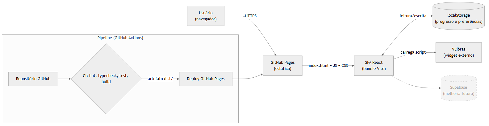
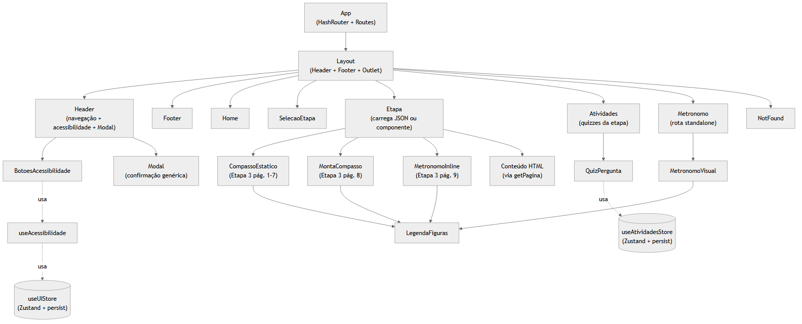
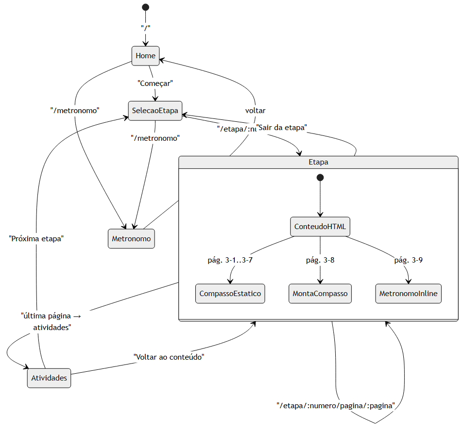
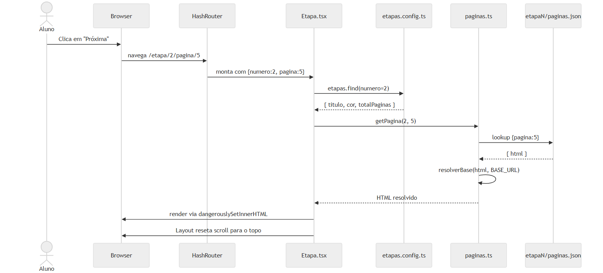

# Arquitetura do Sistema

## Visão geral

O **Módulo de Musicalização para Surdos** é uma _Single Page Application_ (SPA) construída com **React 18 + TypeScript** e empacotada pelo **Vite**. O artefato gerado pelo build é um conjunto de arquivos estáticos (`dist/`) que é servido diretamente pelo **GitHub Pages**, sem servidor de aplicação dedicado. Toda a lógica executa no navegador do usuário; a persistência é feita em `localStorage` do próprio cliente.

A escolha de uma SPA estática é deliberada e está alinhada com o público-alvo (escolas públicas, alunos com banda variável): o tamanho do bundle é pequeno, a página carrega uma única vez e a navegação subsequente é instantânea, sem novas requisições ao servidor.

### Diagrama de implantação



> Fonte editável: [`docs/diagramas/src/01-implantacao.mmd`](diagramas/src/01-implantacao.mmd)

A componente _Supabase_ aparece pontilhada porque está fora do escopo defendido — ver [`melhorias-futuras.md`](melhorias-futuras.md).

---

## Modelo em camadas

A aplicação é organizada em três camadas, cada uma com responsabilidade bem delimitada:

| Camada | Responsabilidade | Pasta |
|---|---|---|
| **Apresentação** | Componentes React (rotas, layout, UI) | [`src/routes/`](../src/routes/), [`src/components/`](../src/components/) |
| **Lógica de UI** | Hooks, stores Zustand, derivações | [`src/hooks/`](../src/hooks/), [`src/stores/`](../src/stores/) |
| **Conteúdo declarativo** | Dados pedagógicos versionados em JSON/TS | [`src/content/`](../src/content/) |

A separação **conteúdo × lógica** é o princípio organizador: o conteúdo pedagógico autoral foi convertido para arquivos JSON em [`src/content/etapaN/paginas.json`](../src/content/), e a renderização é feita por uma única rota genérica (`Etapa.tsx`) parametrizada por número de etapa e página. Isso elimina a duplicação massiva que existia no código original.

### Diagrama de componentes



> Fonte editável: [`docs/diagramas/src/02-componentes.mmd`](diagramas/src/02-componentes.mmd)

---

## Roteamento

O roteamento é feito com **React Router v6** usando **`HashRouter`** (URLs como `/#/etapa/1/pagina/3`). A escolha por `HashRouter` em vez de `BrowserRouter` é específica para hospedagem em GitHub Pages: como o servidor estático não consegue reescrever rotas para `index.html`, o `BrowserRouter` exigiria o _hack_ de `404.html` que duplica o `index.html`. O hash, por especificação HTTP, fica no cliente — qualquer URL é resolvida sem suporte do servidor.

Mapa de rotas (definido em [`src/App.tsx`](../src/App.tsx)):

| Caminho | Componente | Função |
|---|---|---|
| `/` | `Home` | Tela inicial |
| `/etapas` | `SelecaoEtapa` | Grid das 4 etapas |
| `/etapa/:numero` | `Etapa` | Página 1 da etapa |
| `/etapa/:numero/pagina/:pagina` | `Etapa` | Página específica |
| `/etapa/:numero/atividades` | `Atividades` | Quizzes da etapa |
| `/metronomo` | `Metronomo` | Metrônomo visual standalone |
| `*` | `NotFound` | 404 |

### Fluxo de rotas



> Fonte editável: [`docs/diagramas/src/06-fluxo-rotas.mmd`](diagramas/src/06-fluxo-rotas.mmd)

---

## Estado e persistência

O estado da aplicação é gerenciado por **Zustand** com middleware `persist`. Há duas _stores_ globais:

- [`useAtividadesStore`](../src/stores/atividadesStore.ts) — registra respostas dos quizzes em `localStorage` sob a chave `atividades-respostas`. Cada resposta contém `atividadeId`, `opcaoEscolhida`, `acertou`, `respondidoEm`.
- [`useUIStore`](../src/stores/uiStore.ts) — preferências de UI (tema light/dark, nível de zoom 70–180%) sob a chave `ui-preferences`.

O escopo defendido **não inclui sincronização entre dispositivos** nem identificação de aluno: o progresso é local. A migração para um backend (Supabase) está descrita em [`melhorias-futuras.md`](melhorias-futuras.md) — por design, basta substituir a implementação interna das stores por chamadas a serviços, sem alterar o consumidor (componentes).

---

## Renderização do conteúdo pedagógico

O conteúdo das Etapas 1, 2 e 4 (texto, imagens, tabelas) está armazenado em arquivos JSON com o formato `[{ pagina, html }]`. A função [`getPagina(etapa, pagina)`](../src/content/paginas.ts) retorna o HTML, e o componente `Etapa.tsx` renderiza via `dangerouslySetInnerHTML`. Caminhos de imagens usam o placeholder `{{BASE}}`, resolvido em runtime para `import.meta.env.BASE_URL` — isso permite que o mesmo bundle funcione tanto em desenvolvimento (`/`) quanto em produção (`/modulo-musicalizacao/`).

A Etapa 3 é mista: as páginas 1 a 7 são renderizadas pelo componente React `CompassoEstatico`, que produz "trilhos" coloridos a partir de uma estrutura de dados tipada ([`src/content/etapa3/compassos-estaticos.ts`](../src/content/etapa3/compassos-estaticos.ts)); a página 8 é o `MontaCompasso` (atividade interativa com áudio sincronizado via `AudioContext`); a página 9 é o `MetronomoInline` (metrônomo embutido).

### Sequência: navegação entre páginas



> Fonte editável: [`docs/diagramas/src/05-sequencia-navegacao.mmd`](diagramas/src/05-sequencia-navegacao.mmd)

---

## Acessibilidade

A acessibilidade é pilar central — não _feature_. O público-alvo (alunos surdos) impôs decisões que permeiam todas as camadas:

- **Cor como linguagem primária**: figuras rítmicas mapeadas para cores; o sistema funciona sem áudio em qualquer parte conceitual.
- **VLibras** (widget externo): janela de tradução em LIBRAS sempre disponível.
- **Controles de zoom** (70–180%): aplicados via `documentElement.style.fontSize` — toda a tipografia em `rem` escala consistentemente, incluindo conteúdo legacy injetado via `dangerouslySetInnerHTML`.
- **Tema light/dark**: alternância via atributo `data-bs-theme` no `<html>`, com paleta slate-azul para contraste em ambientes de baixa luminosidade.
- **Modal de confirmação no logotipo do header**: previne navegação acidental por toques leves no celular.
- **Scroll restoration manual**: `Layout.tsx` reseta `window.scrollTo(0,0)` a cada mudança de rota porque o React Router v6 não restaura scroll por padrão — sem isso, no celular as telas "abriam no meio".
- **ARIA**: `aria-live="polite"` no contêiner de conteúdo da etapa, `aria-label` em controles, `progress` semântico para barra de páginas.

---

## Acoplamento e fluxo de dados

A aplicação não usa _context providers_ nem _props drilling_ profundo: as duas stores Zustand são consumidas como hooks por qualquer componente que precise. Componentes de UI puros (sem estado global) são preferidos sempre que possível.

A árvore de dependências é deliberadamente rasa:

```
App → Layout → { Header, Footer, <rotas> }
                  ↓
                rotas → componentes especializados → stores/hooks
```

Não há _service layer_ entre componentes e stores — o escopo atual não justifica essa indireção. Essa camada será introduzida quando o backend Supabase entrar (ver `melhorias-futuras.md`).
