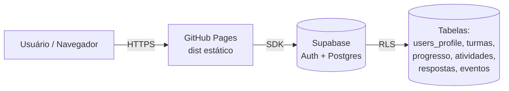

# Arquitetura do Sistema

> **Status:** rascunho inicial (Semana 1). Será expandido ao longo da refatoração com diagramas Mermaid/PlantUML.

## Visão geral

O sistema é uma SPA React compilada estaticamente (Vite) e servida via GitHub Pages, com backend BaaS (Supabase) para autenticação, progresso do aluno, atividades com pontuação e analytics anônimo.

## Camadas

| Camada | Responsabilidade | Tecnologia |
|---|---|---|
| Apresentação | Renderização, interação, acessibilidade | React + Bootstrap |
| Lógica de UI | Orquestração de estado, rotas | React Router, Zustand |
| Serviços | Chamadas ao backend | `supabase-js`, camada `services/` |
| Dados | Persistência relacional | Postgres (Supabase) |

## Padrões

- **Separation of Concerns** via componentização
- **Single Source of Truth** via stores Zustand
- **Row Level Security** no Postgres para autorização
- **Strict TypeScript** para contratos explícitos

## Diagramas pendentes

- [ ] Diagrama de componentes (Mermaid)
- [ ] Diagrama ER do banco
- [ ] Diagrama de sequência: login
- [ ] Diagrama de sequência: submeter atividade
- [ ] Diagrama de casos de uso (aluno, professor)
