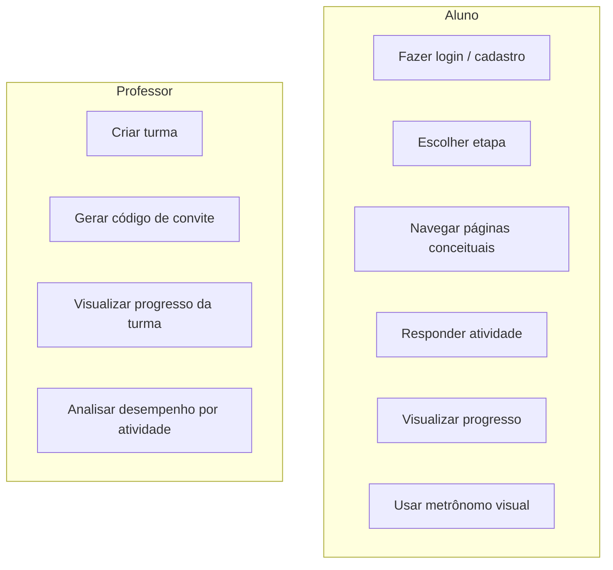

# Casos de Uso

> **Status:** rascunho (Semana 1). Será refinado com especificação textual completa.

## Atores

- **Aluno (surdo)**: consome conteúdo, realiza atividades, acompanha progresso
- **Professor**: cria turma, acompanha progresso dos alunos, analisa métricas
- **Sistema**: registra eventos anônimos de uso

## Diagrama

## Casos de uso principais

### UC-01 — Realizar atividade
1. Aluno acessa etapa
2. Sistema exibe pergunta
3. Aluno responde
4. Sistema valida, registra resposta e exibe feedback
5. Ao final da etapa, sistema exibe relatório de acertos

### UC-02 — Acompanhar progresso da turma (professor)
1. Professor faz login
2. Sistema exibe lista de turmas
3. Professor seleciona turma
4. Sistema exibe dashboard com progresso agregado
5. Professor pode navegar para visão individual do aluno
