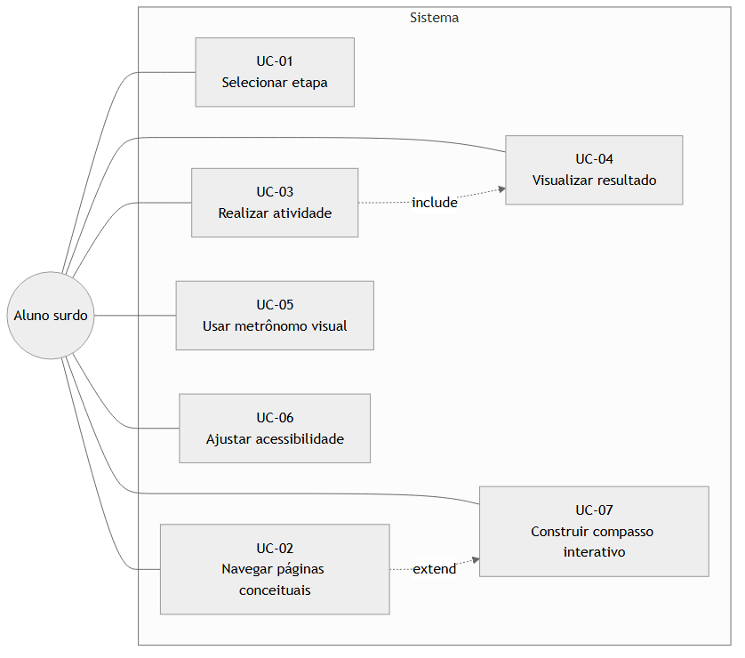
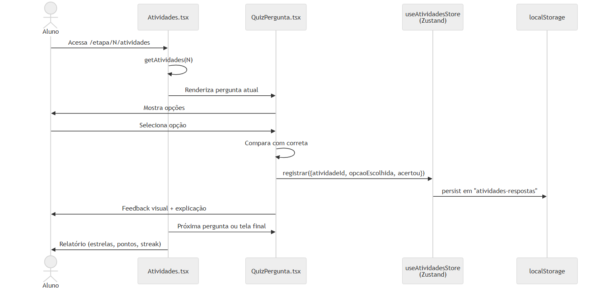

# Casos de Uso

## Atores

No escopo defendido, o sistema possui **um único ator humano**:

- **Aluno (visitante surdo)** — interage diretamente com a aplicação no navegador. Não há autenticação: o sistema é público e qualquer pessoa que acesse a URL exerce esse papel.

> O ator **Professor** está descrito em [`melhorias-futuras.md`](melhorias-futuras.md) e depende da introdução de backend (Supabase). Não está implementado no escopo atual.

## Diagrama de casos de uso

> Fonte editável: [`docs/diagramas/src/03-casos-de-uso.mmd`](diagramas/src/03-casos-de-uso.mmd)

---

## UC-01 — Selecionar etapa

| Campo | Descrição |
|---|---|
| **Ator** | Aluno |
| **Pré-condição** | Aplicação carregada na rota raiz `/` |
| **Fluxo principal** | 1. Aluno clica em "Começar" na Home.   2. Sistema exibe `/etapas` com os 4 cards (Conhecendo as figuras, Elementos da bateria, Atividades de reforço, Vídeos de orquestra).   3. Aluno clica num card.   4. Sistema navega para `/etapa/N` (página 1). |
| **Fluxo alternativo** | Aluno acessa diretamente o link de uma etapa (ex.: bookmark) — o sistema abre na página 1. |
| **Pós-condição** | Página 1 da etapa renderizada. |

## UC-02 — Navegar páginas conceituais

| Campo | Descrição |
|---|---|
| **Ator** | Aluno |
| **Pré-condição** | Em uma etapa (`/etapa/N/pagina/P`) |
| **Fluxo principal** | 1. Sistema renderiza o conteúdo HTML da página atual (texto, figuras, tabelas, vídeos).   2. Aluno clica em "Próxima →".   3. Sistema avança a página, atualiza a barra de progresso, reseta scroll para o topo. |
| **Fluxo alternativo** | Aluno clica em "← Anterior" para voltar; ou em "Sair da etapa" / Header (com modal de confirmação) para abandonar. |
| **Pós-condição** | Página seguinte renderizada, ou na última página o botão muda para "Ir para atividades →". |

## UC-03 — Realizar atividade

| Campo | Descrição |
|---|---|
| **Ator** | Aluno |
| **Pré-condição** | Etapa concluída (chegou à última página) |
| **Fluxo principal** | 1. Sistema exibe a primeira pergunta de múltipla escolha.   2. Aluno seleciona uma opção.   3. Sistema valida, exibe feedback (acerto/erro + explicação opcional) e atualiza pontuação.   4. Resposta persistida em `localStorage` via `useAtividadesStore`.   5. Sistema avança para próxima pergunta. |
| **Fluxo alternativo** | Etapa sem atividades (Etapa 4): pula direto para o UC-04. |
| **Pós-condição** | Todas as perguntas respondidas; estado salvo. |

### Diagrama de sequência

> Fonte editável: [`docs/diagramas/src/04-sequencia-quiz.mmd`](diagramas/src/04-sequencia-quiz.mmd)

## UC-04 — Visualizar resultado

| Campo | Descrição |
|---|---|
| **Ator** | Aluno |
| **Pré-condição** | Atividades concluídas (ou etapa sem atividades) |
| **Fluxo principal** | 1. Sistema exibe tela final com 3 estrelas proporcionais ao desempenho, total de pontos, _streak_ máximo, mensagem contextual.   2. Aluno clica em "Próxima etapa →" ou "Concluir etapa →" (se não houver próxima). |
| **Pós-condição** | Aluno retorna a `/etapas` ou avança para a próxima etapa. |

## UC-05 — Usar metrônomo visual

| Campo | Descrição |
|---|---|
| **Ator** | Aluno |
| **Pré-condição** | Aplicação carregada |
| **Fluxo principal** | 1. Aluno acessa `/metronomo`.   2. Sistema exibe controles de BPM e visualizador rítmico (quadrados coloridos pulsando).   3. Aluno ajusta BPM.   4. Sistema sincroniza animação visual com `AudioContext` (mesmo clock do áudio). |
| **Pós-condição** | Metrônomo rodando até o aluno parar ou navegar para fora. |

## UC-06 — Ajustar acessibilidade

| Campo | Descrição |
|---|---|
| **Ator** | Aluno |
| **Pré-condição** | Em qualquer página do sistema |
| **Fluxo principal** | 1. Aluno clica em A+/A− (zoom) ou no botão de contraste no Header.   2. Sistema atualiza `font-size` do `<html>` (zoom) ou alterna `data-bs-theme` (tema).   3. Preferências persistem em `localStorage` (`ui-preferences`). |
| **Pós-condição** | Preferências aplicadas e mantidas em sessões futuras. |

## UC-07 — Construir compasso interativo

| Campo | Descrição |
|---|---|
| **Ator** | Aluno |
| **Pré-condição** | Etapa 3, página 8 (`MontaCompasso`) |
| **Fluxo principal** | 1. Sistema exibe duas pistas de compasso vazias e um grid de figuras (semicolcheia, colcheia, semínima, mínima).   2. Aluno clica em figuras para preencher os compassos.   3. Aluno clica em "Tocar sequência".   4. Sistema toca o áudio (clap.wav) sincronizado com animação visual via `AudioContext` + `requestAnimationFrame`. |
| **Fluxo alternativo** | Aluno clica em "Limpar" para reiniciar. |
| **Pós-condição** | Sequência tocada; aluno pode editar e tocar novamente. |
