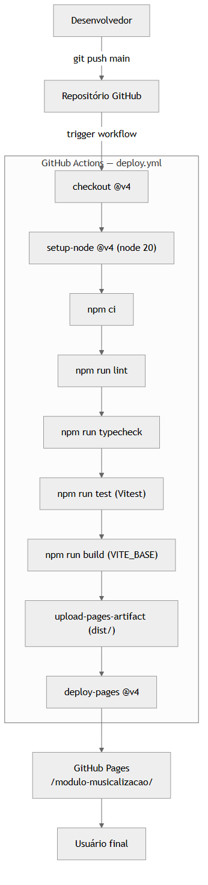

# Hospedagem e CI/CD

## Plataforma

A aplicação é hospedada no **GitHub Pages**, serviço gratuito de hospedagem estática integrado ao GitHub. A URL pública segue o padrão `https://<usuário>.github.io/modulo-musicalizacao/`.

A escolha por GitHub Pages é coerente com a natureza da aplicação (SPA estática sem backend) e oferece:

- **Custo zero** — sem cobrança por banda, requisições ou armazenamento dentro dos limites gratuitos.
- **HTTPS automático** — certificado provisionado pelo GitHub.
- **Integração nativa com Git** — o deploy é disparado por `git push` na branch `main`, sem credenciais externas.
- **Disponibilidade global** — servido por CDN do GitHub.
- **Histórico** — cada deploy é versionado por commit, permitindo rastrear o que foi publicado quando.

A limitação principal — apenas conteúdo estático, sem _runtime_ servidor — é o que motiva categorizar funcionalidades dependentes de backend (autenticação, dashboard professor, analytics) como melhorias futuras (ver [`melhorias-futuras.md`](melhorias-futuras.md)).

---

## Pipeline GitHub Actions

O pipeline está definido em [`.github/workflows/deploy.yml`](../.github/workflows/deploy.yml). Toda alteração na branch `main` dispara automaticamente o ciclo:



> Fonte editável: [`docs/diagramas/src/07-pipeline-cicd.mmd`](diagramas/src/07-pipeline-cicd.mmd)

### Etapas detalhadas

| Etapa | Comando/Action | O que faz |
|---|---|---|
| **1. Checkout** | `actions/checkout@v4` | Baixa o código do commit que disparou o workflow. |
| **2. Setup Node** | `actions/setup-node@v4` (node 20, cache npm) | Instala Node.js 20 e prepara o cache do `~/.npm` para acelerar builds subsequentes. |
| **3. Install** | `npm ci` | Instala dependências exatamente conforme `package-lock.json` (instalação reproduzível). |
| **4. Lint** | `npm run lint` | ESLint com `--max-warnings 0` — qualquer warning quebra o pipeline. |
| **5. Typecheck** | `npm run typecheck` | `tsc --noEmit` — falha em qualquer erro de tipo. |
| **6. Test** | `npm run test` | Vitest com a suíte completa de testes unitários. |
| **7. Build** | `npm run build` | Compila TypeScript e empacota com Vite, gerando `dist/`. Variável `VITE_BASE=/modulo-musicalizacao/` define o caminho público. |
| **8. Upload artifact** | `actions/upload-pages-artifact@v3` | Empacota `dist/` como artefato de Pages. |
| **9. Deploy** | `actions/deploy-pages@v4` | Publica o artefato em GitHub Pages. |

Os jobs são divididos em dois: `build` (etapas 1–8) e `deploy` (etapa 9, depende de `build`). Essa separação segue o padrão recomendado pelo GitHub (permissões mínimas em cada job).

### Permissões

```yaml
permissions:
  contents: read       # ler o código
  pages: write         # publicar em Pages
  id-token: write      # OIDC para deploy
```

### Concorrência

```yaml
concurrency:
  group: pages
  cancel-in-progress: true
```

Garantia de que dois pushes próximos não causem deploys simultâneos — o anterior é cancelado e o novo prevalece.

---

## Variável `VITE_BASE`

O Vite precisa saber o caminho público para gerar URLs corretas de assets dentro do bundle. Em desenvolvimento, o servidor serve em `/`; em produção, o GitHub Pages serve em `/modulo-musicalizacao/`. A variável de ambiente `VITE_BASE` resolve essa diferença:

```ts
// vite.config.ts
const base = process.env.VITE_BASE ?? '/modulo-musicalizacao/';
```

O mesmo valor é propagado para o conteúdo HTML legacy via placeholder `{{BASE}}` em runtime (`import.meta.env.BASE_URL`), garantindo que uma imagem como `{{BASE}}img/seminima.png` funcione tanto local quanto em produção.

---

## Gates de qualidade automatizados

O pipeline funciona como uma **proteção contra regressões**: nenhum código com erro de lint, tipo ou teste chega ao usuário final.

| Gate | Bloqueia? | Justificativa |
|---|---|---|
| `npm run lint` | Sim | Qualquer warning ESLint (incluindo regras de acessibilidade `jsx-a11y`) impede deploy. |
| `npm run typecheck` | Sim | Erros de tipo TypeScript impedem deploy — contratos sempre coerentes em produção. |
| `npm run test` | Sim | 15 testes unitários precisam passar. |
| `npm run build` | Sim | Falha de bundling (import faltante, sintaxe inválida) impede deploy. |

Essa configuração transforma o repositório em uma fonte única de verdade: se está em `main`, está em produção e passou nos gates.

---

## Operação local

Para reproduzir o que o pipeline faz, basta:

```bash
npm ci
npm run lint
npm run typecheck
npm run test
npm run build
npm run preview     # serve o build localmente em http://localhost:4173/modulo-musicalizacao/
```

A simetria entre local e CI é intencional: o desenvolvedor pode validar localmente exatamente o que será validado no GitHub Actions.
