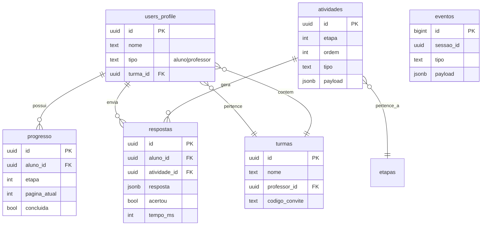

# Modelo de Dados

> **Status:** rascunho (Semana 1). SQL oficial em `supabase/migrations/`.

## Entidades

## Políticas RLS (resumo)

- `progresso`: aluno lê/escreve apenas com `aluno_id = auth.uid()`; professor lê se `aluno` pertence à sua turma.
- `respostas`: idem.
- `atividades`: leitura pública autenticada; escrita apenas via service role.
- `eventos`: inserção anônima permitida; leitura apenas service role.
